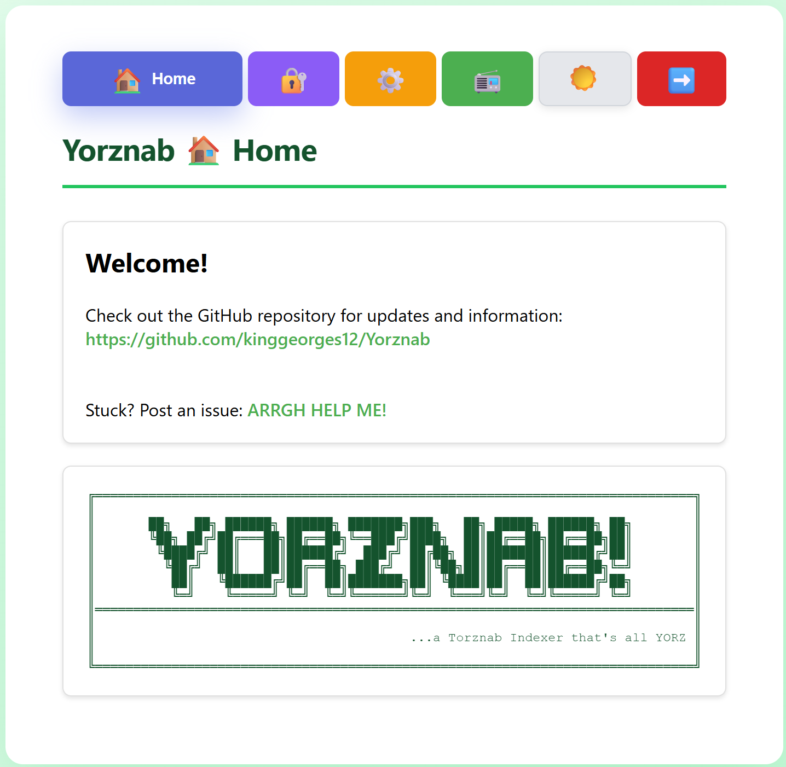
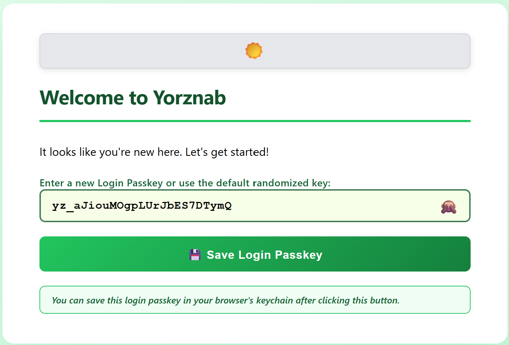
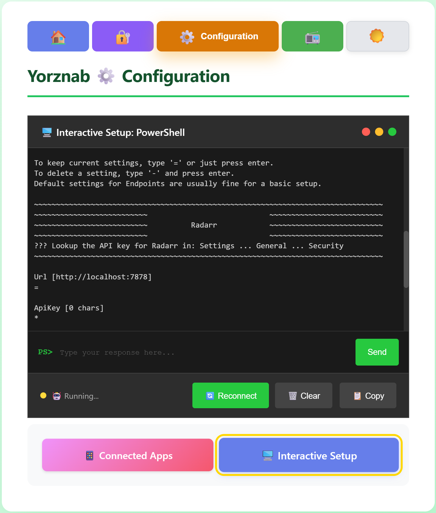
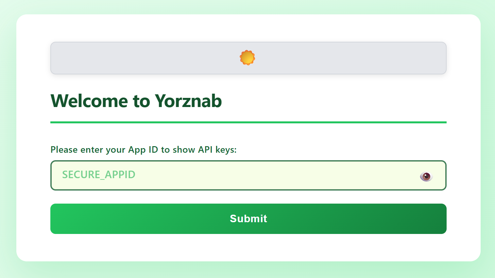
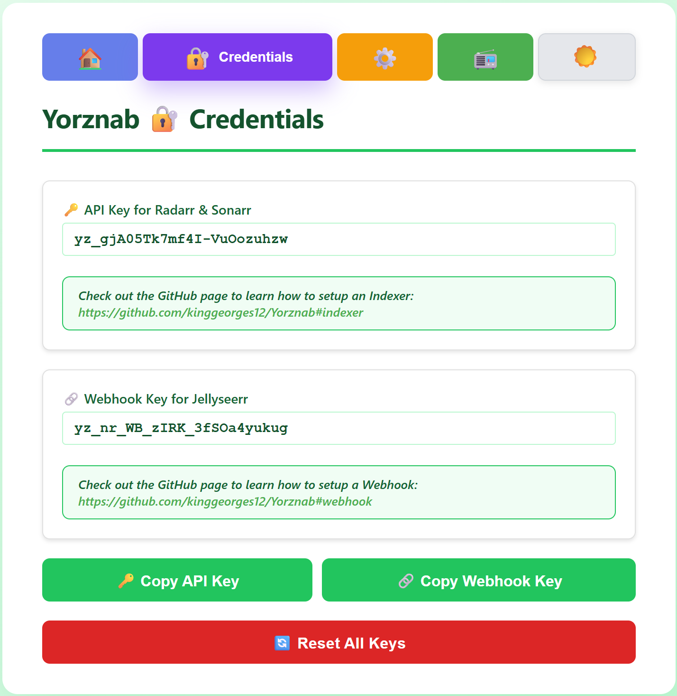
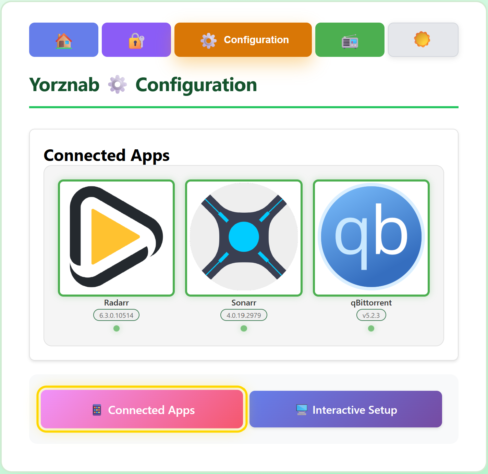
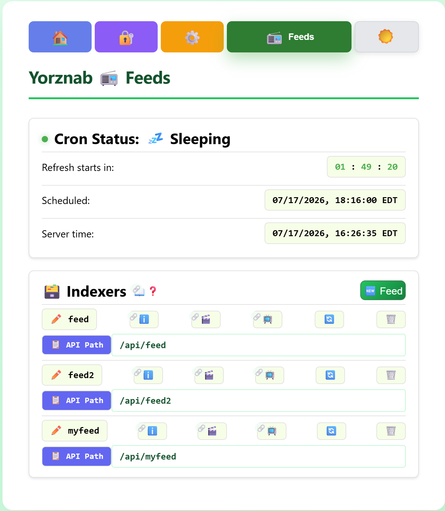
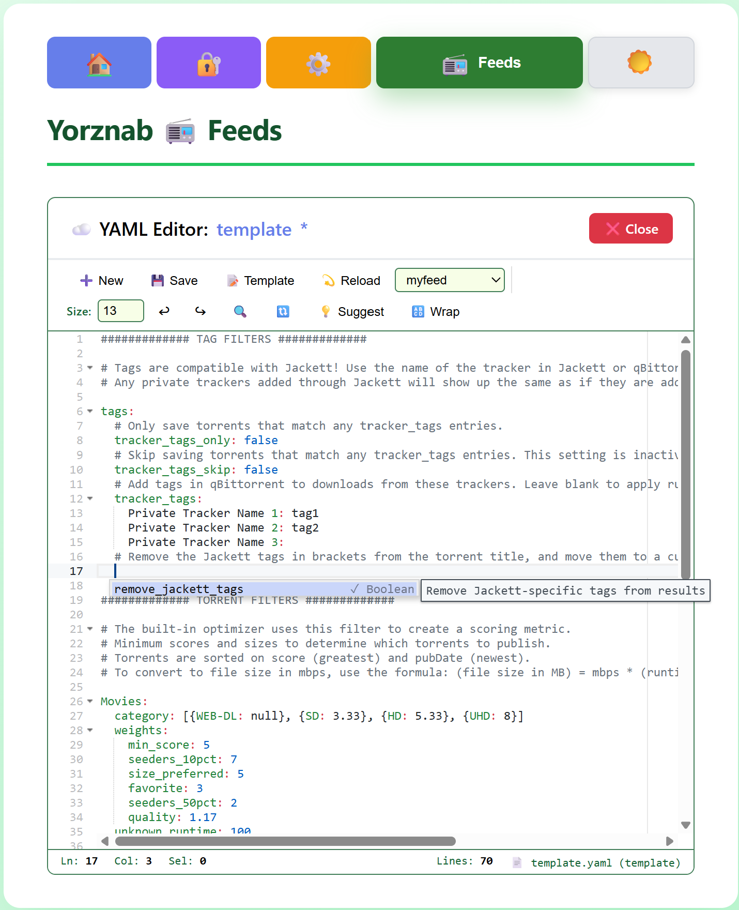

<div align="center">
  <picture>
    <source media="(prefers-color-scheme: dark)" srcset="server/static/banner.svg">
    <source media="(prefers-color-scheme: light)" srcset="server/static/banner-light.svg">
    
  </picture>
</div>

# Yorznab
Ever wanted to make your own Torznab server of your own? Now you can! Okay, lemme explain what Torznab is first..

Welcome to Yorznab, the best way to connect your Radarr and Sonarr apps to download clients without a Usenet or Torznab subscription. Connect Seerr \(Jellyseerr\) to automatically search for requested media through qBittorrent. Radarr and Sonarr use the Yorznab feed to query and request torrents from supported download clients like qBittorrent.

<div align="center">
  <picture>
    <source media="(prefers-color-scheme: dark)" srcset="Screenshots/Home.png">
    <source media="(prefers-color-scheme: light)" srcset="Screenshots/Home-2.png">
    
  </picture>
</div>

# Getting Started
These instructions will setup the Python app on your localhost in Docker. Let's get started already!
1. [Install Yorznab](#install-yorznab): Run the setup script to install Yorznab to the server or localhost.
2. [Docker Compose](#docker-compose): Build the container to access the Yorznab dashboard on the web.
3. [Connect Apps](#connect-apps): Grab setup keys from the Yorznab dashboard and copy them into your apps.

# Features
Keep up-to-date using the [Update Yorznab](#update-yorznab) section.

- Identify the Wanted media from Radarr and Sonarr apps to build search queries.
- Search the qBittorrent API for Wanted media and build a Yorznab \(Torznab-like\) RSS feed from the search results.
- Serve the Yorznab feed as an Indexer for Radarr and Sonarr apps.
- Cron job to initiate automatic Yorznab feed refreshes.
- Receive webhook requests from Seerr \(Jellyseerr\) to refresh the feed with the requested media.
- Filter through qBittorrent search results to ensure high quality torrents.
- Generate multiple feeds to handle private trackers separately to allow seeding requirements for Indexers in Radarr and Sonarr apps.
- Dashboard to retrieve credentials for Yorznab, monitor connections to external apps, enter credentials from external apps, and check the status of Yorznab feeds.

# Requirements
Compatible with Windows or Unix-like systems. Requires the following services to fully use this app. All optional apps are recommended! Tested versions shown below:

- Ubuntu v26
- Docker v29 \(optional\)
- [Seerr](https://github.com/seerr-team/seerr) v3 configured with Radarr and Sonarr \(optional\)
- [Radarr](https://github.com/Radarr/Radarr) v6 configured with a download client
- [Sonarr](https://github.com/sonarr/sonarr) v4 configured with a download client
- [qBittorrent](https://github.com/qbittorrent/qBittorrent) v5
- [Jackett](https://github.com/Jackett/Jackett) v\.24 \(optional\)

# Install Yorznab
The section downloads the Github code to your PC or server and installs the basic configuration. Run the following installation commands using the OS-specific application. For upgrading an existing installation, see the [Updates](#updates) section.

## Unix \(Shell\)
```
YORZNAB_DIR=/path/to/yorznab
sudo mkdir -p "${YORZNAB_DIR}/app"
cd "${YORZNAB_DIR}"
sudo chown -R $(id -un):$(id -gn) .
wget -O yorznab-main.tar.gz https://github.com/kinggeorges12/Yorznab/archive/refs/heads/main.tar.gz
tar --strip-components=1 -xvzf yorznab-main.tar.gz -C ./app
cd app
cp --update=none ./config/yorznab.yaml.demo ./config/yorznab.yaml
cp --update=none ./config/feed.yaml.demo ./config/feeds/myfeed.yaml # Recommended
```

## Windows \(PowerShell\)
```
$YORZNAB_DIR='C:\Docker\yorznab'
New-Item -Path "${YORZNAB_DIR}" -ItemType Directory -Force
Set-Location "${YORZNAB_DIR}"
Invoke-WebRequest -Uri "https://github.com/kinggeorges12/Yorznab/archive/refs/heads/main.zip" -OutFile "yorznab-main.zip"
Expand-Archive -Path "yorznab-main.zip" -DestinationPath $env:TEMP
Get-ChildItem "$env:TEMP\yorznab-main\" -Force | Move-Item -Destination .
Set-Location app
Copy-Item -Confirm -Path ./config/yorznab.yaml.demo -Destination ./config/yorznab.yaml
Copy-Item -Confirm -Path ./config/feed.yaml.demo -Destination ./config/myfeed.yaml # Recommended
```

# Docker Compose
This starts the service in Docker. Follow instructions in the docker-compose.yml template to customize the Yorznab container. For native installation options, see the [Help](#help) section.

## Unix \(Shell\)
```
YORZNAB_DIR=/path/to/yorznab
cd "${YORZNAB_DIR}"
mkdir -p logs python
sudo chown -R $(id -un):$(id -gn) .
sed "s|/path/to/yorznab|${YORZNAB_DIR}|g" ./app/docker-compose.yml > ./app/docker-compose-run.yml
docker compose -f ./app/docker-compose-run.yml up -d
```

## Windows \(PowerShell\)
```
$YORZNAB_DIR='C:\Docker\yorznab'
cd "${YORZNAB_DIR}"
(Get-Content './app/docker-compose.yml') -replace '/path/to/yorznab','C:/Docker/yorznab' | Set-Content ./app/docker-compose-run.yml
docker compose -f ./app/docker-compose-run.yml up -d
```

## Login to the Dashboard
The Yorznab dashboard contains status information and setup help. Authenticate through the dashboard for the first time to create the `LOGIN_PASSKEY`. Open a web browser with access to the server and point it at the base url of the Docker container, e.g., [`http://localhost:9116/`](http://localhost:9116/) or http://myserver.local:9116/.

<div align="center">
  <picture>
    <source media="(prefers-color-scheme: dark)" srcset="Screenshots/Authentication.png">
    <source media="(prefers-color-scheme: light)" srcset="Screenshots/Authentication-2.png">
    
  </picture>
</div>

Note: if you lose your passkey, retrieve it from the server in the `config/keys.yml` file.

## Interactive Setup
The dashboard features an 🖥️ Interactive Setup that helps input your credentials from connected apps. Yorznab needs to communicate with Radarr and Sonarr to process Wanted media, and qBittorrent to search torrents. Click ▶️ Connect and follow the prompts to update your connections.

<div align="center">
  <picture>
    <source media="(prefers-color-scheme: dark)" srcset="Screenshots/InteractiveSetup.png">
    <source media="(prefers-color-scheme: light)" srcset="Screenshots/InteractiveSetup-2.png">
    
  </picture>
</div>

# Connect Apps
Setup the Radarr and Sonarr apps' Indexer to start using Yorznab to automatically search for torrents. Setup the Seerr app to begin refreshing the Yorznab feed automatically and provide instant updates when content is requested. Navigate to the 🔐 Credentials page on the Yorznab dashboard to view your keys for the API and webhook.

<div align="center">
  <picture>
    <source media="(prefers-color-scheme: dark)" srcset="Screenshots/Login.png">
    <source media="(prefers-color-scheme: light)" srcset="Screenshots/Login-2.png">
    
  </picture>
</div>

Note: The 🔑 API Key and 🔗 Webhook Key are randomly generated when Yorznab starts in Docker.

## Indexer
Adding an Indexer allows Radarr and Sonarr to query Yorznab for links to Wanted media. To access the API key, login to the Yorznab dashboard and navigate to 🔐 Credentials.

<div align="center">
  <picture>
    <source media="(prefers-color-scheme: dark)" srcset="Screenshots/Credentials.png">
    <source media="(prefers-color-scheme: light)" srcset="Screenshots/Credentials-2.png">
    
  </picture>
</div>

1. Open Radarr or Sonarr in your browser.
2. Go to **Settings → Indexers → + → Torznab**.
3. Click the gear at the bottom of the settings page to show advanced settings.
4. Fill-in these settings, using values from the dashboard or default settings in parentheses:
    - Name: Yorznab
    - Enable RSS: ✅
    - Enable Automatic Search: ✅
    - Enable Interactive Search: ✅
    - URL (defaults\*): http://localhost:9116
    - API Path (defaults\*): /api
    - API Key (dashboard: INDEXER_KEY): YOUR_INDEXER_KEY
    - \[RADARR\] Categories: ✅ Movies \(all\)
    - \[SONARR\] Categories: ✅ TV \(all except 🔲 Anime\)
    - \[SONARR\] Anime Categories: 🔲TV > ✅ Anime \(only\)
    - \[SONARR\] Anime Standard Format Search: ✅
    - Minimum Seeders: 1 *recommended*
    - Seed Ratio, Seed Time, Season-Pack Seed Time: see [Tags](#tags)
    - Reject Blocklisted Torrent Hashes While Grabbing: ✅
    - Indexer Priority: 25 *default*
    - \[SONARR\] Maximum Single Episode Age: 730 (any day after will grab season packs)
5. Click the Test button in each app to ensure that they can reach the Yorznab server.

### Indexer default settings
- URL: Server Address from App (Radarr/Sonnar server pings Yorznab) and `./app/docker-compose.yml` \(ports\) and  and `./app/config/yorznab.yaml` \(feed → link\)
- API Path: `./app/config/yorznab.yaml` \(server → api_endpoint\)

## Webhook
This allows Seerr to notify Yorznab when new media is requested. To access the Webhook key, login to the Yorznab dashboard and navigate to 🔐 Credentials.

1. Open Seerr in your browser.
2. Go to **Settings → Notifications → Webhook**.
3. Fill-in these settings, using values from `config/yorznab.yaml` in parentheses:
    - Enable Agent: Yorznab: ✅
    - Support URL Variables: 🔲
    - Webhook URL (feed: link/webhook_endpoint): http://localhost:9116/webhook
    - Authorization Header \(dashboard: WEBHOOK_KEY\): YOUR_WEBHOOK_KEY
    - JSON Payload: *do not change default*
    - Notification Types \(🔲 Others\):
        - ✅ Request Automatically Approved
        - ✅ Request Approved

### Webhook default settings
- Webhook URL: `./app/docker-compose.yml` \(ports\) and `./app/config/yorznab.yaml` \(feed → link/webhook_endpoint\)

# Testing Yorznab
The ⚙️ Configuration page on the Yorznab dashboard provides the status of connected apps. Configure the app credentials in the [Install Yorznab](#install-yorznab) section.

<div align="center">
  <picture>
    <source media="(prefers-color-scheme: dark)" srcset="Screenshots/Configuration.png">
    <source media="(prefers-color-scheme: light)" srcset="Screenshots/Configuration-2.png">
    
  </picture>
</div>

# Feeds
Access the 📻 Feeds page on the Yorznab dashboard to edit and control your feeds. Implement filters in your feeds to allow for curated search results from qBittorrent. By default, the sample feed is loaded when you install Yorznab. Try using the ☁️ YAML Editor to read the configuration hints and customize your feed.

<div align="center">
  <picture>
    <source media="(prefers-color-scheme: dark)" srcset="Screenshots/Feeds.png">
    <source media="(prefers-color-scheme: light)" srcset="Screenshots/Feeds-2.png">
    
  </picture>
</div>

To turn off the feed filters: delete all feeds from the 📻 Feeds page on the Yorznab dashboard.

## Tags
The tags section of feed files allow creating multiple Indexers for Radarr and Sonarr to fulfill your seeding requirements on certain trackers. The tags are also helpful for monitoring progress of torrents in qBittorrent from specific trackers, e.g., private trackers and public trackers.

<div align="center">
  <picture>
    <source media="(prefers-color-scheme: dark)" srcset="Screenshots/YAML_Editor.png">
    <source media="(prefers-color-scheme: light)" srcset="Screenshots/YAML_Editor-2.png">
    
  </picture>
</div>

1. Navigate to the 📻 Feeds page of the Torznab dashboard.
2. To open the ☁️ YAML Editor, click New Feed or Edit one of your existing feeds.
3. Add the tags settings for the feed. The Indexer will use this feed to find viable torrents, so use each feed like a set of preferences for specific trackers.
4. Create a new Indexer in Radarr and Sonarr using the feed address, see [Indexer](#indexer).

Here is an example feed for outputting only torrents matching your private trackers. Locate the tracker names in the qBittorrent search or Jackett dashboard.
```
tags:
  # Remove the Jackett tags in brackets from the torrent title, and move them to a custom field "jackett".
  remove_jackett_tags: true
  # Only save torrents that match any tracker_tags entries.
  tracker_tags_only: true
  # Skip saving torrents that match any tracker_tags entries. This setting is inactive when tracker_tags_only is active.
  tracker_tags_skip: false
  # Add tags in qBittorrent to downloads from these trackers. Leave blank to apply rules (only or skip) without tagging in qBittorrent.
  tracker_tags:
    Private Tracker Name 1: qbit-tag1
    Private Tracker Name 2: qbit-tag2
    Private Tracker Name 3: 
```

## Multiple Indexers
The Radarr and Sonarr apps allow you to configure specific rules for seeding based on the Indexer. This setup allows for special seeding requirements for private trackers.

1. Navigate to the 📻 Feeds page on the Yorznab dashboard.
2. Click the 🆕 Feed button.
3. Start from the ➕ New file or 📝 Template file.
4. Add the flag indicating the type of Yorznab feed, e.g. list private trackers in the `tracker_tags` section and set the following:
    - Private trackers: `tracker_tags_only: true` and `tracker_tags_skip: false`
    - Public trackers: `tracker_tags_only: false` and `tracker_tags_skip: true`
5. Save the file and reload the 📻 Feeds page.
6. Copy the 📋 API Path of your new feed to use in the next step.
7. Include each Indexer in Radarr and Sonarr apps using the instructions in [Indexer](#indexer).
8. Apply rules in Radarr and Sonarr apps to continue seeding after downloading, e.g., Seed Ratio, Seed Time.

## Jackett
Yorznab looks for Jackett tags in search results automatically. The brackets in search results indicate the tracker, e.g., \[Tracker\] torrent. Use the flag `remove_jackett_tags` to removes those bracketed trackers from the filename.

# Updates
The GitHub tagged releases will update the Yorznab installation to a specific version. Run the update steps below. If you run into issues connecting to your apps, update your App settings in the new version by running the 🖥️ Interactive Setup on the ⚙️ Configuration page on the Yorznab dashboard.

## Unix \(Shell\)
```
YORZNAB_DIR=/path/to/yorznab
version=v1.0
docker stop yorznab
sudo mkdir -p "${YORZNAB_DIR}/app"
cd "${YORZNAB_DIR}"
sudo chown -R $(id -un):$(id -gn) .
wget -O yorznab-main.tar.gz https://github.com/kinggeorges12/Yorznab/archive/refs/tags/$version.tar.gz
tar --strip-components=1 -xvzf yorznab-main.tar.gz -C ./app
docker start yorznab
```

## Windows \(PowerShell\)
```
$YORZNAB_DIR='C:\Docker\yorznab'
$version='v1.0'
docker stop yorznab
New-Item -Path "${YORZNAB_DIR}" -ItemType Directory -Force
Set-Location "${YORZNAB_DIR}"
Invoke-WebRequest -Uri "https://github.com/kinggeorges12/Yorznab/archive/refs/tags/$version.zip" -OutFile "yorznab-main.zip"
Expand-Archive -Path "yorznab-main.zip" -DestinationPath $env:TEMP
Get-ChildItem "$env:TEMP\yorznab-main\" -Force | Move-Item -Destination .
docker start yorznab
```

# Help

This section will guide you on how to find your App credentials and setup Yorznab.

## Radarr/Sonarr
This allows Yorznab to pull lists of Wanted items from Sonarr and Radarr.

1. Open Radarr or Sonarr in your browser.
2. Go to **Settings → General → Security**.
3. Copy the **API Key**.

## qBittorrent
This allows Yorznab to query the qBittorrent search engine.

1. Open qBittorrent WebUI in your browser.
2. Go to **Settings → WebUI → Authentication**.
3. Copy the **API Key** (`qbt_...`).
4. If the qBittorrent version does not have API Key option, provide the `Username` and `Password` and DO NOT include the ApiKey.

## Native Installation
Docker is not required! To run natively on your operating system, just download, install, build & run:

1. Download: Click `Code > Download Zip` at the top of this page.
2. Install: Unzip to any folder. Ensure you have prerequisites in your command path: python 3.11+, pip, etc.
3. Build: Open a command prompt and navigate to the project folder. Run the OS-specific build and run files:
  - \[Unix Shell\] `cd /path/to/yorznab/app && sudo chmod +x build.sh run.sh setup.sh && ./run.sh`
  - \[Windows PowerShell\] `Set-Location C:\Docker\yorznab\app && ./build.ps1 && ./run.ps1`
4. Visit the Yorznab dashboard to finish setup, e.g., https://localhost:9116/

## Manual Docker Setup
Sometimes you want to do it yourself, or the installer just doesn't work. Here are the manual setup instructions.
1. *Download Yorznab*: Click `Code > Download Zip` at the top of this page.
2. *Install Yorznab*: Unzip into your Docker folder.
3. *Docker Compose*: Customize the [docker-compose.yml](docker-compose.yml) file and launch the container.
4. *Configure App Keys*: Run the 🖥️ Interactive Setup on the ⚙️ Configuration page on the Yorznab dashboard. Alternatively, open `config/settings.yaml` file, edit the Url and ApiKey for each app, then restart the container. For reference, see [`settings.yaml.demo`](config/settings.yaml.demo).
5. *Connect apps*: Retrieve your keys from the 🔐 Credentials page on the Yorznab dashboard. Alternatively, read the `config/keys.yaml` file. Input the 🔑 API Key in Radarr and Sonarr. Input the 🔗 Webhook Key Jellyseerr.

# Development
Setup the local Python environment for contributing to this project.

1. Install [Python](https://www.python.org/downloads/) \(test on 3.11+\) on your server or PC. Ensure this is available in your shell: `python --version`
2. Fork the project to your own Github.
3. Follow the instructions in [Native Installation](#Native-Installation) to run Yorznab in your IDE.
4. Update the codebase and create a pull request.

# AI Disclosure
What you're reading on this page was not written by AI. I wrote the Torznab code for this in 2025 without AI, or even an IDE. You might be able to confirm this from looking at my spaghetti code in the [first commit](https://github.com/kinggeorges12/Yorznab/commit/f6ca64b8d559aafe647cdb8f0c9cacda5c0535b9). Most of the work was looking up the endpoints available for the protocol. More recently, I used AI to generate the front-end web server. I also regenerated my utility functions with AI to incorporate some features the desktop app was missing like handling the timezone and settings.

# Copyright Notice
Please follow applicable copyright laws for your country and the [GitHub Acceptable Use Policies](https://docs.github.com/en/site-policy/acceptable-use-policies/github-acceptable-use-policies).
