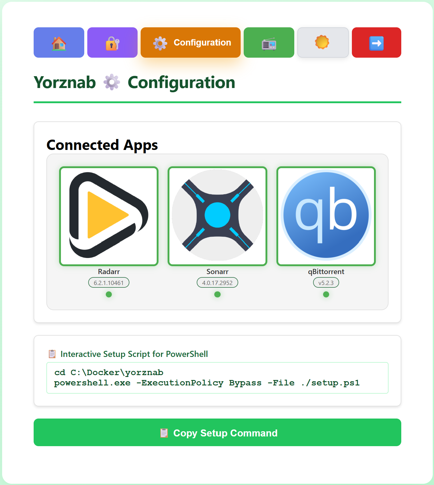

<div align="center">
  <picture>
    <source media="(prefers-color-scheme: dark)" srcset="server/static/banner.svg">
    <source media="(prefers-color-scheme: light)" srcset="server/static/banner-light.svg">
    
  </picture>
</div>

# Yorznab
Ever wanted to make your own Torznab server of your own? Now you can!

Welcome to Yorznab, the best way to connect your Radarr and Sonarr apps to download clients without a Usenet or Torznab subscription. Connect Seerr \(Jellyseerr\) to automatically search for requested content through qBittorrent and publish a Yorznab RSS feed. Radarr and Sonarr use the Yorznab RSS feed to find and request torrents from supported download clients like qBittorrent.

<div align="center">
  <picture>
    <source media="(prefers-color-scheme: dark)" srcset="Screenshots/Configuration-Linux.png">
    <source media="(prefers-color-scheme: light)" srcset="Screenshots/Configuration-Windows-2.png">
    
  </picture>
</div>

# Requirements
Compatible with Linux or Windows. Requires the following services to fully use this app. Current tested configuration:

- Ubuntu v26
- Docker v29
- [Seerr](https://github.com/seerr-team/seerr) v3 configured with Radarr and Sonarr
- [Radarr](https://github.com/Radarr/Radarr) v6 configured with a download client
- [Sonarr](https://github.com/sonarr/sonarr) v4 configured with a download client
- [qBittorrent](https://github.com/qbittorrent/qBittorrent) v5
- [Jackett](https://github.com/Jackett/Jackett) v\.24 \(optional\)

# Getting Started
These instructions will setup the Python app on your localhost in Docker. Following these steps will help you get started quickly.
1. Install Yorznab: Run the setup script to install Yorznab to the server or localhost.
2. Docker Compose: Build the container to access the Yorznab dashboard on the web.
3. Connect Apps: Grab setup keys from the Yorznab dashboard and copy them into your apps.

# Install Yorznab
The automated setup tool \(`setup.sh` or `setup.ps1`\) initializes the Radarr, Sonarr and qBittorrent app credentials. For help finding your credentials, see the [Help](#help) section.

## Linux
```
sudo mkdir -p /srv/dev/yorznab/app
cd /srv/dev/yorznab
sudo chown -R $(id -un):$(id -gn) .
wget -O yorznab-main.tar.gz https://github.com/kinggeorges12/Yorznab/archive/refs/heads/main.tar.gz
tar --strip-components=1 -xvzf yorznab-main.tar.gz -C ./app
cp --update=none ./app/config/yorznab.yaml.sample ./app/config/yorznab.yaml
cp --update=none ./app/config/filters.yaml.sample ./app/config/filters.yaml # Recommended
sudo chmod +x setup.sh
./setup.sh
```

## Windows
```
New-Item -Path C:\Docker\yorznab -ItemType Directory -Force
Set-Location C:\Docker\yorznab
Invoke-WebRequest -Uri "https://github.com/kinggeorges12/Yorznab/archive/refs/heads/main.zip" -OutFile "yorznab-main.zip"
Expand-Archive -Path "yorznab-main.zip" -DestinationPath $env:TEMP
Get-ChildItem "$env:TEMP\yorznab-main\" -Force | Move-Item -Destination .
Copy-Item -Confirm -Path ./app/config/yorznab.yaml.sample -Destination ./app/config/yorznab.yaml
Copy-Item -Confirm -Path ./app/config/filters.yaml.sample -Destination ./app/config/filters.yaml
powershell -ExecutionPolicy Bypass -File ./setup.ps1
```

# Docker Compose
This starts the service in Docker. Be sure to include the `SECURE_APPID` setting in `docker-compose.yml` to allow access to the dashboard for the first-time setup. After initial setup, remove `SECURE_APPID` from the Docker file, and retrieve it from the server in the `app/config/keys.yml` file to continue using the dashboard.

## Linux
```
cd /srv/dev/yorznab
mkdir -p logs export python
sudo chown -R $(id -un):$(id -gn) .
docker compose -f ./app/docker-compose.yml up -d
```

## Windows
```
cd C:\Docker\yorznab
(Get-Content 'docker-compose.yml') -replace '/srv/dev/yorznab','C:/Docker/yorznab' | Set-Content docker-compose-windows.yml
docker compose -f ./app/docker-compose-windows.yml up -d
```

# Connect Apps
The Yorznab dashboard provides a way to see your credentials for the API and webhook. Just click the Test button in each app to ensure that they can reach the Yorznab server.

Setting the `SECURE_APPID` in your Docker compose will allow you to easily login for first-time setups, e.g., [`http://localhost:9118/`](http://localhost:9118/).

<div align="center">
  <picture>
    <source media="(prefers-color-scheme: dark)" srcset="Screenshots/Login.png">
    <source media="(prefers-color-scheme: light)" srcset="Screenshots/Login-2.png">
    
  </picture>
</div>

<div align="center">
  <picture>
    <source media="(prefers-color-scheme: dark)" srcset="Screenshots/Credentials.png">
    <source media="(prefers-color-scheme: light)" srcset="Screenshots/Credentials-2.png">
    
  </picture>
</div>

## Indexer
This allows Radarr and Sonarr to query Yorznab for torrents. The keys for `API_KEY` and `FEED_KEY` are randomly generated when Yorznab starts in Docker and stored in `config/keys.yaml`.

Setting the `SECURE_APPID` in your Docker compose will allow you to easily login for first-time setups, e.g., [`http://localhost:9118/`](http://localhost:9118/).

1. Open Radarr or Sonarr in your browser.
2. Go to **Settings → Indexers → + → Torznab**.
3. Click the gear at the bottom of the settings page to show advanced settings.
4. Fill-in these settings, using values from the dashboard and [default settings]() in parentheses:
    - Name: Yorznab
    - Enable RSS: ✅
    - Enable Automatic Search: ✅
    - Enable Interactive Search: ✅
    - URL (defaults\*): http://localhost:9118
    - API Path (defaults\*): /api
    - API Key (dashboard: API_KEY): YOUR_API_KEY
    - \[RADARR\] Categories: ✅ Movies \(all\)
    - \[SONARR\] Categories: ✅ TV \(all except 🔲 Anime\)
    - \[SONARR\] Anime Categories: 🔲TV > ✅ Anime \(only\)
    - \[SONARR\] Anime Standard Format Search: ✅
    - Minimum Seeders: 1 *recommended*
    - Seed Ratio, Seed Time, Season-Pack Seed Time: see [Tags](#tags)
    - Reject Blocklisted Torrent Hashes While Grabbing: ✅
    - Indexer Priority: 25 *default*
    - \[SONARR\] Maximum Single Episode Age: 730 (any day after will grab season packs)

### Indexer default settings
- URL: Server Address from App (Radarr/Sonnar server pings Yorznab) and `./app/docker-compose.yml` \(ports\) and  and `./app/config/yorznab.yaml` \(feed → link\)
- API Path: `./app/config/yorznab.yaml` \(server → api_endpoint\)

## Webhook
This allows Seerr to notify Yorznab when new content is requested. Access the credentials page on the Yorznab dashboard to find the webhook key.

1. Open Seerr in your browser.
2. Go to **Settings → Notifications → Webhook**.
3. Fill-in these settings, using values from `config/yorznab.yaml` in parentheses:
    - Enable Agent: Yorznab: ✅
    - Support URL Variables: 🔲
    - Webhook URL (feed: link/webhook_endpoint): http://localhost:9118/webhook
    - Authorization Header \(dashboard: WEBHOOK_KEY\): YOUR_WEBHOOK_KEY
    - JSON Payload: *do not change default*
    - Notification Types \(🔲 Others\):
        - ✅ Request Automatically Approved
        - ✅ Request Approved

### Webhook default settings
- Webhook URL: `./app/docker-compose.yml` \(ports\) and `./app/config/yorznab.yaml` \(feed → link/webhook_endpoint\)

# Testing Yorznab
The Yorznab dashboard features a configuration page that provides a status of connected apps. Configure the app credentials in the [Install Yorznab](#install-yorznab) section.

<div align="center">
  <picture>
    <source media="(prefers-color-scheme: dark)" srcset="Screenshots/Configuration-Linux.png">
    <source media="(prefers-color-scheme: light)" srcset="Screenshots/Configuration-Windows-2.png">
    
  </picture>
</div>

# Filters
The default qBittorrent search engine is built for manual intervention. Implement filters to allow for more automation-friendly search results. By default, the sample is applied when you setup Yorznab. Explore the sample filter and read instructions in [filters.yaml.sample](config/filters.yaml.sample).

Turn off the filter by removing the file in `/app/config/filters.yaml`.

## Tags
Private trackers often have seeding requirements. You can use tags in qBittorrent to separate these from public trackers. Simply setup your TrackerTags section in `config/filter.yaml` for your private trackers.
```
tags:
  # Remove the Jackett tags in brackets from the torrent title, and move them to a custom field "jackett"
  remove_jackett_tags: true
  # Only output torrents matching TrackerTags entries below
  tracker_tags_only: false
  # Add tags in qBittorrent to downloads from these trackers
  tracker_tags:
    Private Tracker Name 1: privatetracker1.com
    Private Tracker Name 2: privatetracker2.com
    Private Tracker Name 3: privatetracker3.com
```

## Multiple Indexers
The Radarr and Sonarr apps allow you to configure specific rules for seeding based on the Indexer. This setup allows for special seeding requirements for private trackers.
1. Create another instance of Yorznab (e.g., PrivateYorznab) for each tracker seed requirements.
2. Open your `config/filter.yaml` file and add the flag indicating the type of Yorznab instance:
    - Private trackers: `tracker_tags_only: true`
    - Public trackers: `tracker_tags_skip: true`
3. Include each indexer in Radarr and Sonarr apps using the instructions in [Indexer](#indexer).
4. Apply rules in Radarr and Sonarr apps to continue seeding after downloading.

## Jackett
Yorznab looks for Jackett tags in search results automatically. The brackets in search results indicate the tracker, e.g., \[Tracker\] torrent. Use the flag `remove_jackett_tags` to removes those bracketed trackers from the filename.

# Help

This section will guide you on how to find your App credentials and setup Yorznab.

## Radarr/Sonarr
This allows Yorznab to pull lists of Wanted items from Sonarr and Radarr.

1. Open Radarr or Sonarr in your browser.
2. Go to **Settings → General → Security**.
3. Copy the **API Key** to `ApiKey` under the Radarr or Sonarr entry.

## qBittorrent
This allows Yorznab to query the qBittorrent search engine.

1. Open qBittorrent WebUI in your browser.
2. Go to **Settings → WebUI → Authentication**.
3. Copy the **API Key** (`qbt_...`).
4. If the qBittorrent version does not have API Key option, provide the `QUsername` and `QPassword` and DO NOT include the QApiKey.

## Manual Setup
Sometimes you want to do it yourself, or the installer just doesn't work. Here are the manual setup instructions.
1. Download Yorznab: click `Code > Download Zip` at the top of this page.
2. Install Yorznab: unzip into your Docker folder.
3. Configure App Keys: open `config/settings.yaml` and edit the Url and ApiKey under each app. For reference, see [settings.yaml.sample](config/settings.yaml.sample).
4. Docker Compose: customize the [docker-compose.yml](docker-compose.yml) file and launch the container.
5. Connect apps: get your setup keys from `config/keys.yaml` and input them in Radarr, Sonarr, and Jellyseerr.

# Development
Setup the local Python environment for running locally without Docker.

1. Install [Python](https://www.python.org/downloads/) \(test on 3.11+\) on your server or PC. Ensure this is available in your shell: `python --version`
2. Run the following commands for your OS:
    - \[Linux Shell\] `cd /srv/dev/yorznab/app && sudo chmod +x build.sh run.sh setup.sh && ./run.sh`
    - \[Windows PowerShell\] `Set-Location C:\Docker\yorznab\app && ./build.ps1 && ./run.ps1`
3. Visit https://localhost:9118/status

# AI Disclosure
What you're reading on this page was not written by AI. I wrote the Torznab code for this in 2025 without AI, or even an IDE. You might be able to confirm this from looking at my spaghetti code in [`torznab.py`](server/routers/torznab.py). Mostly done through looking up the endpoints available for the protocol. I used AI to generate the front-end web server. I also regenerated my utility files with AI to accomodate yaml files.

# Copyright Notice
Please follow applicable copyright laws for your country and the [GitHub Acceptable Use Policies](https://docs.github.com/en/site-policy/acceptable-use-policies/github-acceptable-use-policies).
