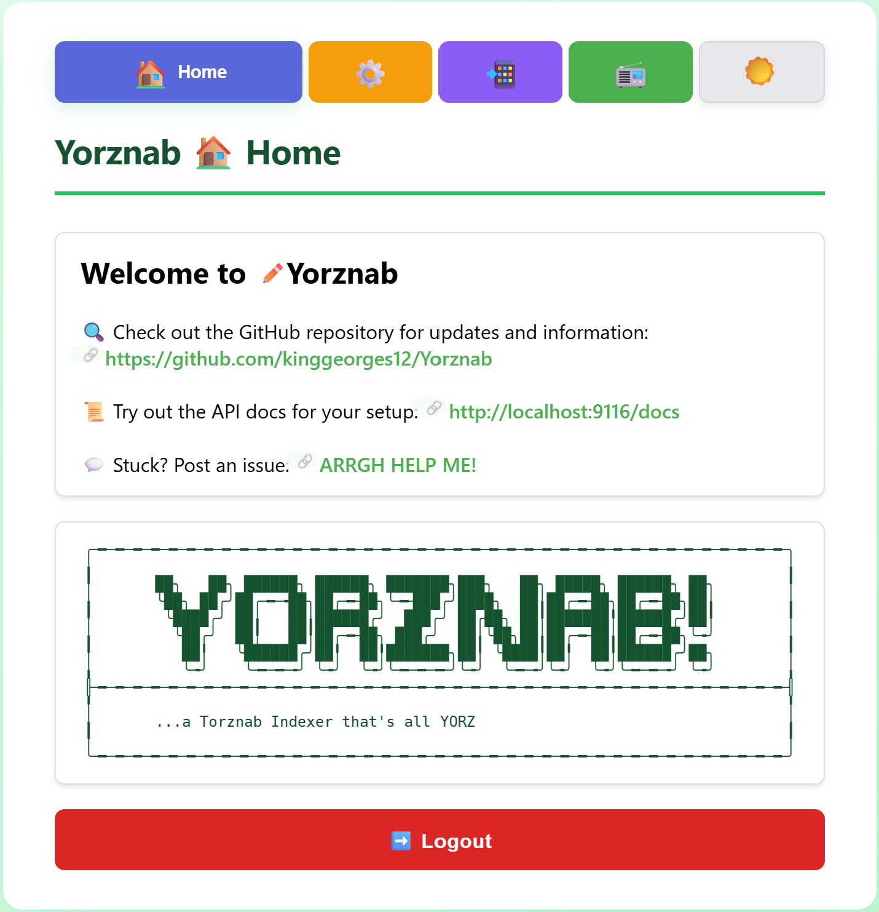
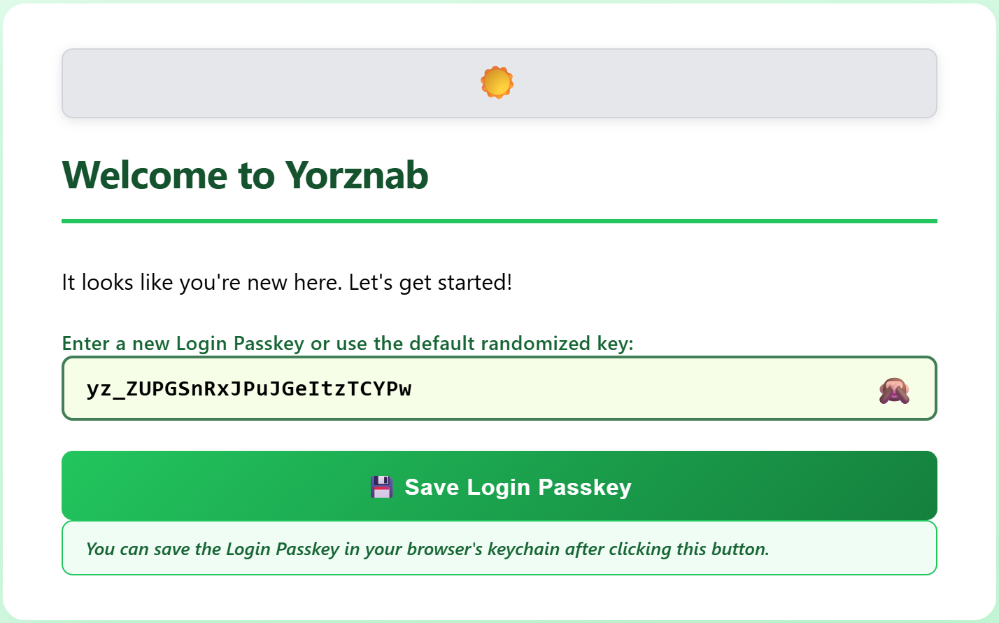
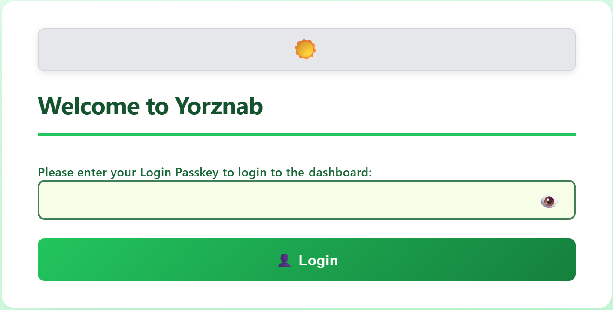
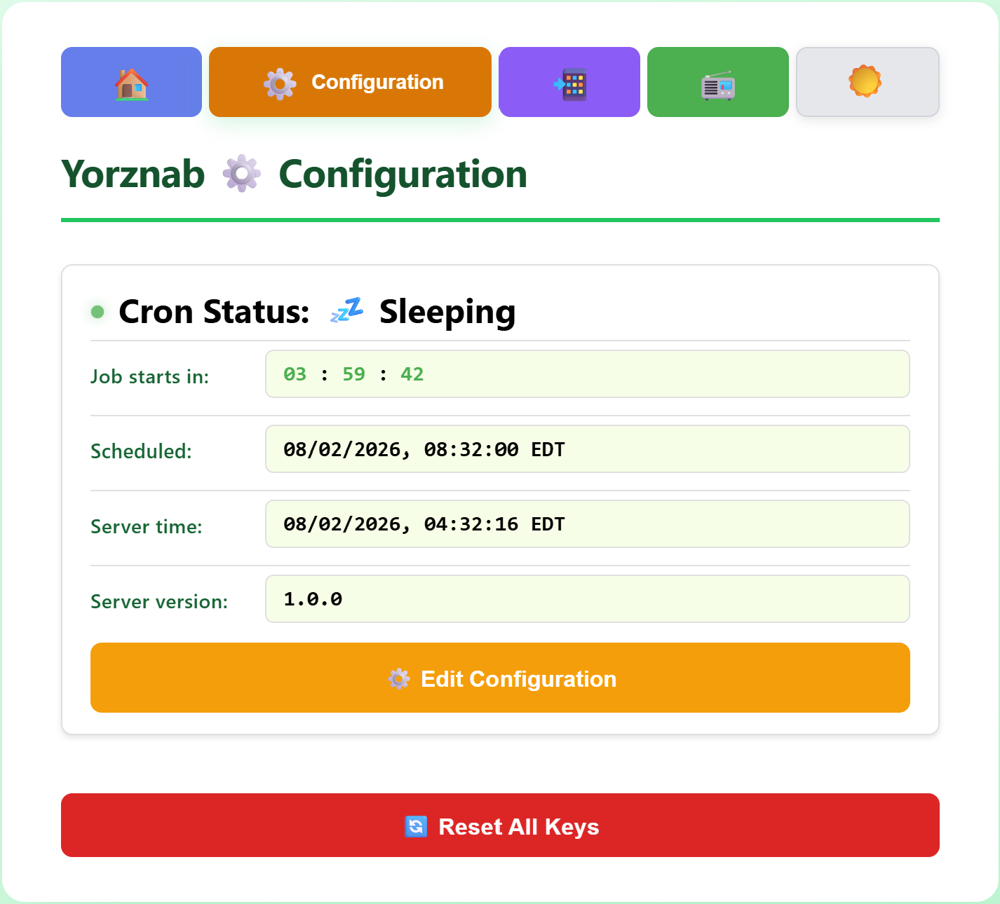
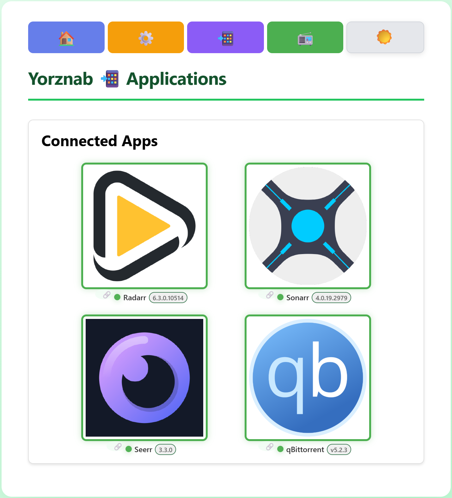
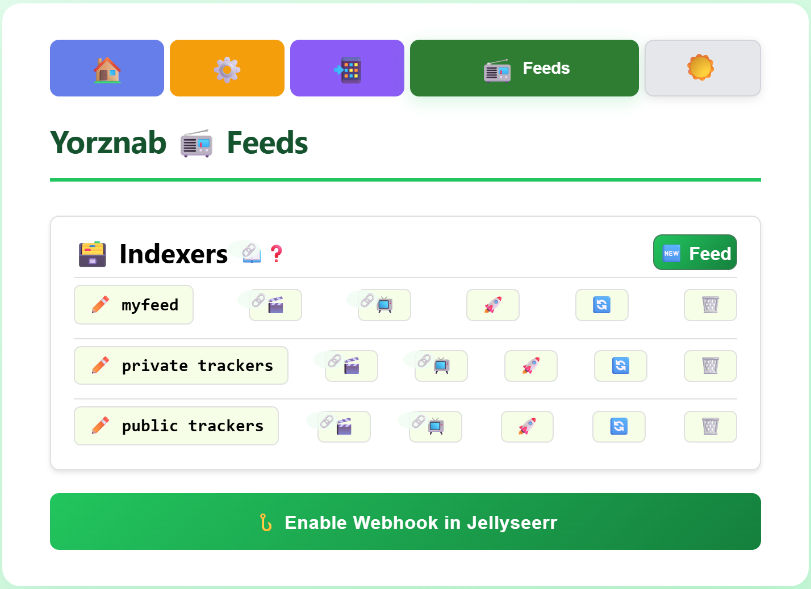
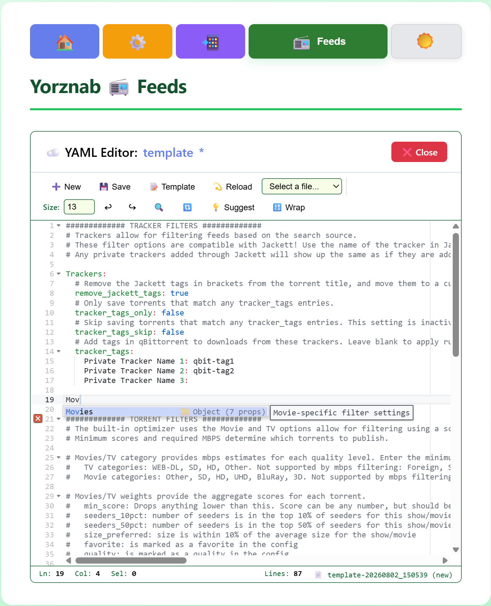

<div align="center">
  <picture>
    <source media="(prefers-color-scheme: dark)" srcset="server/static/banner.svg">
    <source media="(prefers-color-scheme: light)" srcset="server/static/banner-light.svg">
    
  </picture>
</div>

# Yorznab
Ever wanted to make your own Torznab server? Now you can! Okay, lemme explain what Torznab is first..

Welcome to Yorznab, the best way to connect your Radarr and Sonarr apps to download clients without a Usenet or Torznab subscription. Connect Seerr \(Jellyseerr\) to automatically search for requested media through qBittorrent. Radarr and Sonarr use the Yorznab feed to query and request torrents from supported download clients like qBittorrent.

*Why not just use [Prowlarr](https://github.com/Prowlarr/Prowlarr)?* Arr apps require tedious configuration of individual Indexers to query qBittorrent. If you [integrated Jackett into qBittorrent search](https://github.com/qbittorrent/search-plugins/wiki/How-to-configure-Jackett-plugin) or you are happy with the default qBittorrent plugins, just grab the torrent results with Yorznab!

<div align="center">
  <picture>
    <source media="(prefers-color-scheme: dark)" srcset="Screenshots/Home.png">
    <source media="(prefers-color-scheme: light)" srcset="Screenshots/Home-2.png">
    
  </picture>
</div>

# Getting Started
These instructions will set up the Python app on your localhost in Docker. Let's get started already!
1. [Install](#install): Run the setup script to install Yorznab on the server or localhost.
2. [Setup](#setup): Open the Yorznab dashboard and connect to your apps.

# Features

- Dashboard to configure your instance, connect to external apps, and create Yorznab feeds.
- Identify the Wanted media from Radarr and Sonarr apps to build search queries.
- Search the qBittorrent API for Wanted media and build a Yorznab \(Torznab-like\) RSS feed from the search results.
- Serve the Yorznab feed as an Indexer for Radarr and Sonarr apps.
- Cron job to initiate automatic Yorznab feed refreshes.
- Receive webhook requests from Seerr \(Jellyseerr\) to refresh the feed with the requested media.
- Filter through qBittorrent search results to ensure high quality torrents.
- Generate multiple feeds to handle private trackers separately to allow seeding requirements for Indexers in Radarr and Sonarr apps.

# Requirements
Compatible with Windows or Unix (Linux and Mac) systems. Requires the following services to fully use this app. All optional apps are recommended! Tested versions shown below:

- Ubuntu v26
- Docker v29 \(optional\)
- [Radarr](https://github.com/Radarr/Radarr) v6 configured with a download client
- [Sonarr](https://github.com/sonarr/sonarr) v4 configured with a download client
- [qBittorrent](https://github.com/qbittorrent/qBittorrent) v5
- [Jackett](https://github.com/Jackett/Jackett) v\.24 configured with qBittorrent and Flaresolverr \(optional\)
- [Seerr](https://github.com/seerr-team/seerr) v3 configured with Radarr and Sonarr \(optional\)

# Install
This section contains the OS-specific instructions to create the Yorznab directory and keep your installation up-to-date. You can also manually download [`docker-compose-latest.yml`](docker-compose-latest.yml) and follow the instructions to customize the Yorznab container. For Docker-less installation, see the [Native Installation](#native-installation) section.

## Linux/Mac
Open the Terminal from Linux or Mac and run the following commands:
```
YORZNAB_DIR=~/yorznab
sudo mkdir -p "${YORZNAB_DIR}"
cd "${YORZNAB_DIR}"
mkdir -p app logs python
sudo chown -R $(id -un):$(id -gn) .
wget -O ./app/docker-compose-latest.yml https://raw.githubusercontent.com/kinggeorges12/Yorznab/refs/heads/main/docker-compose-latest.yml
sed "s|/path/to/yorznab|${YORZNAB_DIR}|g" ./app/docker-compose-latest.yml > ./app/docker-compose-run.yml
docker compose -f ./app/docker-compose-run.yml up -d
```

## Windows
Open Windows PowerShell and run the following commands:
```
$YORZNAB_DIR='C:\Docker\yorznab'
New-Item -Path "${YORZNAB_DIR}\app" -ItemType Directory -Force
Set-Location "${YORZNAB_DIR}"
icacls "${YORZNAB_DIR}" /grant "BUILTIN\Users":F /T
Invoke-WebRequest -OutFile ".\app\docker-compose-latest.yml" -Uri "https://raw.githubusercontent.com/kinggeorges12/Yorznab/refs/heads/main/docker-compose-latest.yml"
(Get-Content './app/docker-compose-latest.yml') -replace '/path/to/yorznab/',"${YORZNAB_DIR}\" | Set-Content ./app/docker-compose-run.yml
docker compose -f ./app/docker-compose-run.yml up -d
```

# Setup
The Yorznab dashboard displays status information and connects your apps. Open a web browser with access to the server and point it at the base url of the Docker container, e.g., [`http://localhost:9116/`](http://localhost:9116/) or http://myserver.local:9116/.

<div align="center">
  <picture>
    <source media="(prefers-color-scheme: dark)" srcset="Screenshots/Authentication.png">
    <source media="(prefers-color-scheme: light)" srcset="Screenshots/Authentication-2.png">
    
  </picture>
</div>

Enter a new Login Passkey on your first-run. Afterward, the server requires authentication using this credential. *Note*: if you lose your Login Passkey, open the `app/config/keys.yaml` file in the Yorznab directory, and retrieve the `LOGIN_PASSKEY`.

<div align="center">
  <picture>
    <source media="(prefers-color-scheme: dark)" srcset="Screenshots/Login.png">
    <source media="(prefers-color-scheme: light)" srcset="Screenshots/Login-2.png">
    
  </picture>
</div>

## Configure Instance
The `⚙️ Configuration` page on the Yorznab dashboard displays the cron (periodic job) status. Click `⚙️ Edit Configuration` to change the Instance settings. *Note*: the cron uses [cronitor](https://pypi.org/project/croniter/#user-content-usage) format for the Schedule. *Warning*: the `🔄 Reset All Keys` option requires you to refresh all Indexers and the Webhook on the `📻 Feeds` page.

<div align="center">
  <picture>
    <source media="(prefers-color-scheme: dark)" srcset="Screenshots/Configuration.png">
    <source media="(prefers-color-scheme: light)" srcset="Screenshots/Configuration-2.png">
    
  </picture>
</div>

## Link Integrations
Navigate to the `📲 Applications` page on the Yorznab dashboard to enter credentials for your `🧩 Integrations`. After linking to Yorznab, the 🟢 status will display below the app icon. Radarr and Sonarr Indexers query Yorznab to automatically search for torrents. Seerr Requests send a Webhook to Yorznab automatically and provide immediate updates for new media. qBittorrent provides the torrent search for Yorznab to grab results and generate the feed.

<div align="center">
  <picture>
    <source media="(prefers-color-scheme: dark)" srcset="Screenshots/Applications.png">
    <source media="(prefers-color-scheme: light)" srcset="Screenshots/Applications-2.png">
    
  </picture>
</div>

## Create Feeds
Yorznab `🗃️ Indexers` allow Radarr and Sonarr to find viable torrents from feeds, so use each feed like a set of preferences for specific trackers. Access the `📻 Feeds` page on the Yorznab dashboard to edit and publish your feeds. 

<div align="center">
  <picture>
    <source media="(prefers-color-scheme: dark)" srcset="Screenshots/Feeds.png">
    <source media="(prefers-color-scheme: light)" srcset="Screenshots/Feeds-2.png">
    
  </picture>
</div>

### Publish Indexers

Adding a feed to `🗃️ Indexers` allows Radarr and Sonarr to query Yorznab for links to Wanted media. From the `📻 Feeds` page, click the `🚀 Publish` button to create a new Indexer in Radarr and Sonarr for a feed.

- The `🎬 Movie Search` and `📺 TV Search` buttons display the feed contents that Radarr and Sonarr fetch for Wanted media.
- The `🚀 Publish` button sends the following options to Radarr and Sonarr in **Settings → Indexers**:
  - Name: Yorznab
  - Enable RSS: ✅
  - Enable Automatic Search: ✅
  - Enable Interactive Search: ✅
  - URL: http://localhost:9116
  - API Path: /api/v1/indexer/myfeed
  - API Key: \<YOUR_INDEXER_KEY\>
  - \[RADARR\] Categories: ✅ Movies \(all\)
  - \[SONARR\] Categories: ✅ TV \(all except 🔲 Anime\)
  - \[SONARR\] Anime Categories: 🔲TV > ✅ Anime
  - \[SONARR\] Anime Standard Format Search (Yorznab does not support Anime search): 🔲
  - Minimum Seeders: 1
  - Seed Ratio, Seed Time, Season-Pack Seed Time: see [Trackers](#trackers)
  - Reject Blocklisted Torrent Hashes While Grabbing: ✅
  - Indexer Priority: 25
  - \[SONARR\] Maximum Single Episode Age (a year after episode release, Sonarr grabs season packs): 365
- The `🔄 Refresh Feed` button runs the Webhook to refresh the feed by searching qBittorrent for Wanted media in Radarr and Sonarr.
- The `🗑️ Delete Feed` button removes the feed from 🗃️ Indexers. You must delete any published feeds from Radarr and Sonarr manually. *Note*: Recover any accidentally deleted feeds from the Yorznab server within the `app/config/feeds` directory.

### Enable Webhook
The webhook allows Seerr to notify Yorznab when new media is requested. At the bottom of the `📻 Feeds` page, click the `🪝 Enable Webhook in Jellyseerr` button to start searching qBittorrent when users create a Seerr Request.

The `🪝 Enable Webhook in Jellyseerr` button sends the following options to Seerr in **Settings → Notifications → Webhook**:
- Enable Agent: Yorznab: ✅
- Support URL Variables: 🔲
- Webhook URL: http://localhost:9116/webhook
- Authorization Header: \<YOUR_WEBHOOK_KEY\>
- JSON Payload: *use default*
- Notification Types \(🔲 Others\):
  - ✅ Request Automatically Approved
  - ✅ Request Approved

### Apply Filters
Apply filters in your feeds to allow for curated search results from qBittorrent. Click `🆕 Feed` or the name of a feed to open the `☁️ YAML Editor`. Click the `📝 Template` button to display information about feed options. On the first-run, Yorznab loads the default filter for a feed named "myfeed". *Note*: YAML stands for YAML Ain't Markup Language, but more importantly it allows for configuration of the Yorznab instance similar to a Docker compose file.

<div align="center">
  <picture>
    <source media="(prefers-color-scheme: dark)" srcset="Screenshots/YAML_Editor.png">
    <source media="(prefers-color-scheme: light)" srcset="Screenshots/YAML_Editor-2.png">
    
  </picture>
</div>

#### Customize Indexer Seeding Requirements
The `Trackers` section of feed files allow creating multiple Indexers for Radarr and Sonarr to fulfill your seeding requirements on certain trackers. The `tracker_tags` are also helpful for monitoring progress of torrents in qBittorrent from specific trackers, e.g., private trackers and public trackers. The Radarr and Sonarr apps allow you to configure rules for seeding based on the Indexer. This setup allows for special seeding requirements for private trackers.

1. Navigate to the 📻 Feeds page on the Yorznab dashboard.
2. Click the 🆕 Feed button.
3. Start from the ➕ New file or 📝 Template file.
4. Add the flag indicating the type of Yorznab feed:
    - Private trackers: `tracker_tags_only: true` and `tracker_tags_skip: false`
    - Public trackers: `tracker_tags_only: false` and `tracker_tags_skip: true`
5. Locate the tracker names in the qBittorrent search or the Jackett dashboard and add them to the `tracker_tags` section.
6. Save the file and reload the 📻 Feeds page.
7. Click the `🚀 Publish` button to create a new Indexer in Radarr and Sonarr for the feed.
8. Apply rules for the Indexer in Radarr and Sonarr apps to continue seeding after downloading to Seed Ratio, Seed Time, and Season-Pack Seed Time.

Here is an example feed for outputting only torrents matching your private trackers. Locate the tracker names in the qBittorrent search or your Jackett dashboard.
```
Trackers:
  tracker_tags_only: true
  tracker_tags:
    Private Tracker Name 1: qbit-tag1
    Private Tracker Name 2: qbit-tag2
    Private Tracker Name 3: 
```

And here is another feed for outputting just the public trackers! Now you can set the seeding requirements in Radarr and Sonarr for the private and public feeds.
```
Trackers:
  tracker_tags_skip: true
  tracker_tags:
    Private Tracker Name 1: qbit-tag1
    Private Tracker Name 2: qbit-tag2
    Private Tracker Name 3: 
```

# Help

This section will guide you on how to find your App credentials and set up Yorznab.

## Radarr/Sonarr
This allows Yorznab to pull lists of Wanted items from Sonarr and Radarr.

1. Open Radarr or Sonarr in your browser.
2. Go to **Settings → General → Security**.
3. Copy the **API Key**.

## qBittorrent
This allows Yorznab to query the qBittorrent search engine.

1. Open qBittorrent WebUI in your browser.
2. Go to **Settings → WebUI → Authentication**.
3. Copy the **API Key** (`qbt_...`).
4. If the qBittorrent version does not have an API Key option, provide the `Username` and `Password` and leave the API Key blank.

## Seerr
This sends a webhook to Yorznab to immediately search for torrents from new Requests in Seerr.

1. Open Seerr in your browser.
2. Go to **Settings → General**.
3. Copy the **API Key**.

## Native Installation
Docker is not required! To run natively on your operating system, just download, install, and run:

1. Ensure you have prerequisite software in your command path: python \(version 3\.14+\) and pip.
2. Download: Click `Code > Download Zip` at the top of this page.
3. Install: Unzip to any folder.
4. Run: Double-click the `start.bat` or `start.sh` (requires execute permission in Linux).
5. Startup [Optional]: Create a new entry in the Cron/Task Scheduler that launches `start` from the Yorznab directory.
6. Configure: Visit the Yorznab dashboard to finish setup, e.g., https://localhost:9116/
7. Update: Delete the `app/server` directory and begin from Step 1.

# Development
Set up the local Python environment for contributing to this project.

1. Install [Python](https://www.python.org/downloads/) \(current version uses Python 3\.14\) on your server or PC. Ensure this is available in your shell: `python --version`
2. Fork the project on GitHub.
3. Follow the instructions in [Native Installation](#Native-Installation) to run Yorznab in your IDE.
4. Update the codebase and create a Pull Request.

# AI Disclosure
What you're reading on this page was not written by AI. I wrote the Torznab code for this in 2025 without AI or even an IDE. You might be able to confirm this from looking at my spaghetti code in the [first commit](https://github.com/kinggeorges12/Yorznab/commit/f6ca64b8d559aafe647cdb8f0c9cacda5c0535b9). Most of the work was looking up the endpoints available for the protocol. More recently, I used AI to generate the front-end web server. I also regenerated my utility functions with AI to incorporate some features that the desktop app was missing, like handling the timezone and settings.

# Copyright Notice
Please follow applicable copyright laws for your country and the [GitHub Acceptable Use Policies](https://docs.github.com/en/site-policy/acceptable-use-policies/github-acceptable-use-policies).
